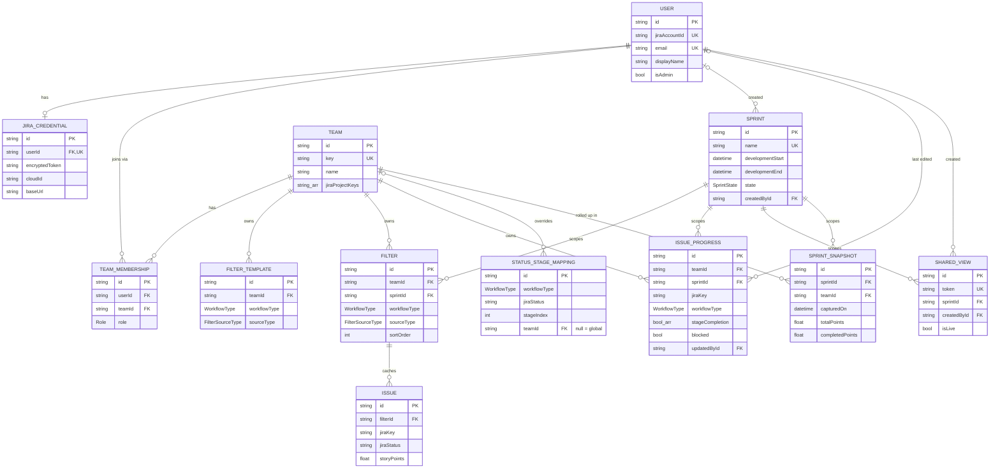

# Sprint Tracker (Tek Tracker) — Project Overview

> **Status of this document:** This is the canonical reference for the Sprint Tracker project.
> Every future feature, refactor, or AI-assisted change should be consistent with this file.
> When reality and this doc diverge, **fix the doc in the same change**. Sections are marked
> **[BUILT]**, **[PARTIAL]**, **[PLANNED]**, or **[GAP]** so the as-built state is never confused
> with the target state.
>
> Last reviewed: 2026-06-10 · Owner: Naveen · Audience: engineers + Claude Code.

---

## 1. Product vision

One fast, comprehensive view of an entire sprint — from roadmap to backlog — in one place,
without hunting through multiple Jira filters. Sprint Tracker sits *on top of* Jira and adds the
**software-development lifecycle (SDLC) granularity** that raw Jira status cannot express, plus
roll-ups that leadership can actually read.

It is an **internal engineering tool at Tekion Corp.**

---

## 2. Problem statement

1. **Filter sprawl.** ED, EM, TPM, QA and developers juggle many Jira filters throughout a sprint —
   roadmap, tech debt, internal bugs, support bugs, UAT issues — each needing constant attention.
2. **No leadership visibility.** VPs & EDs only see a sprint go from `0 → 1` between start and end.
   They have no signal mid-sprint about whether it is **on track**.
3. **Jira status is too coarse.** A single Jira status doesn't capture the real delivery lifecycle:
   `PM clarification → HLD/LLD → coding → API contract → FE/BE integration → E2E testing → demo →
   PR review/deployment → deployment`. Sprint Tracker models these **stages** so an EM/Lead can give
   a granular, trustworthy update upward to ED/VP.

---

## 3. Personas & access model

| Persona | Scope | Primary need |
|---|---|---|
| **Lead** | **1 scrum team** | Capture the full SDLC of a scrum team's Jira work (roadmap, support, tech debt, internal bugs). |
| **EM / SEM** | **2–3 scrum teams** | Capture the full SDLC across their scrum teams; per-team and combined views. |
| **ED / TPM** | **N scrum teams** | Aggregate view across multiple scrum teams. |
| **VP** | Portfolio | High-level "is the sprint on track" health + trend. |
| **Admin** | Org/team config | Manage sprint configuration, gates, team membership. |

Key relationships:
- **Lead manages 1 scrum team; EM/SEM manages 2–3 scrum teams; ED manages N scrum teams.** A user can
  belong to many teams with different roles. EM/SEM and ED-level views are **cross-team roll-ups**, not
  a separate data source.
- Each scrum team has dedicated **filters/tracks**: Roadmap, Tech Debt, Support, Internal Bugs.

> **[GAP]** The current build has **no team, role, or multi-team concept** — it is single-user and
> localStorage-scoped. Multi-team roll-up (the core ED/VP value) is unbuilt. See §9, §10, §15.

---

## 4. Core concepts & glossary

- **Scrum team** — A unit of ~10–12 developers with dedicated tracks (Roadmap, Tech Debt, Support,
  Internal Bugs).
- **Filter / Track** — A Jira source feeding the board. Either a saved **Jira filter ID** or a raw
  **JQL** string. Each filter is tagged with a **workflow type** that decides which stages apply.
- **Workflow** — The stage template for a filter. Three exist today: `feature`, `techdebt`, `support`
  (see §6). Each has ordered stages and per-stage weights.
- **Stage** — A step in the delivery lifecycle for one work item. Stages are tracked as a **manual,
  ordered checklist overlay** on each issue (checking stage *n* auto-checks `0..n`). They are **not**
  currently derived from Jira status — see the critical note in §6.
- **Sprint / Gate** — A named release window with fixed `startDate`/`endDate` (and a release date).
  Tekion calls monthly releases "Gates" (e.g. *June 2026 Release*). All filters and progress are
  **scoped to a sprint**.
- **Health** — Per-issue and per-sprint status (On Track / At Risk / Behind / Blocked / Ahead / Done),
  computed from weighted stage completion vs. time-elapsed expectation (see §14).
- **Velocity** — Story points completed per week, with a naive linear projection to sprint end (§14).
- **Sync** — Pull the latest issues for every filter from Jira Cloud (refreshes the issue list and raw
  status; **does not** change manual stage progress).
- **Share view** — Share the exact configured view with someone else (e.g. EM → senior EM/Director).
- **Export** — A PDF/PNG report (weekly/daily leadership update) with key metrics + per-item breakdown.
- **Delivery Matrix** — The main grid: rows are issues grouped by filter, columns are stages, with
  health on the right and a collapsible "connected JQL" sidebar on the left.

---

## 5. Feature list

| Feature | State | Notes |
|---|---|---|
| Add Jira filters (by filter ID or JQL) | **[BUILT]** | `useSprintData.handleAddFilter`. |
| Update stages per work item | **[BUILT]** | Manual checklist; `toggleStage`. Not Jira-derived. |
| Mark work item as blocked | **[BUILT]** | `toggleBlocked`. |
| Remove Jira filter | **[BUILT]** | `handleRemoveFilter`. |
| Sync Jira (pull live status) | **[BUILT]** | `handleSyncAll`; diffs added/removed issues. |
| Configure sprint (dates, name) | **[PARTIAL]** | Modal exists; **no admin-only gating**, sprint is not a first-class entity (keyed by date range). |
| Reorder filters | **[BUILT]** | Drag + priority default sort. |
| Export PDF / PNG | **[BUILT]** | Client-side `html2canvas` + `jsPDF`; include/exclude filters. |
| Share view | **[PARTIAL]** | Encodes **entire dataset** into a base64 URL — fragile, not live, not access-controlled. |
| Multi-team / ED roll-up | **[GAP]** | No team model. |
| Trend / burndown / "projected by end of sprint" | **[GAP]** | No historical snapshots. |
| AI summary (Gemini) | **[GAP]** | Post-v1; use cases ratified 2026-06-10 (see §16). |
| Admin settings / RBAC | **[GAP]** | No roles. |

---

## 6. Workflows & stages

Defined in [`src/workflows.js`](src/workflows.js). Stages are ordered; weights sum to 100 and drive
weighted completion %.

**`feature` — Feature Development (Roadmap), priority 1**
```
PM clarification → HLD/LLD → API contracts → Working APIs → FE integration →
E2E testing → QA/PM demo → PR approved → Release ready → 1st Stage Env deployment
weights: [15, 20, 15, 15, 15, 8, 5, 3, 2, 2]
```

**`techdebt` — Tech Debt, priority 2**
```
Triaged → In Progress → Code Review → In QA
weights: [15, 65, 15, 5]
```

**`support` — Support Bugs, priority 3**
```
Triaged → In Progress → Code Review → In QA
weights: [20, 60, 15, 5]
```

> **Spec note:** The handwritten spec lists **Internal Bugs** as a fourth track. Today internal bugs
> reuse the `support`/`techdebt` 4-stage workflow. If Internal Bugs needs its own stages/weights, add
> a `internalbug` workflow.

### ⚠️ Critical design decision: stages are manual, not synced

Today, **stage completion is a manual overlay** stored per issue (`issueStages[key].stages` = array of
booleans) and toggled by the user. Jira **Sync** refreshes the issue list and raw Jira status but
**does not populate stage progress**. `transformJiraIssue` computes a `stage`/`percent` from Jira
status, but those values are effectively unused — the real progress comes from manual checkboxes.

Consequences:
- All health/velocity/% metrics are only as accurate as the team's manual discipline.
- The 10-stage feature lifecycle does not map 1:1 to Jira statuses, so full automation isn't trivial.

**Recommended target model (hybrid):** on first sync, *seed* `stageCompletion` from a configurable
Jira-status → stage mapping; thereafter manual edits win and are persisted. Store the last
Jira-derived baseline so re-syncs can reconcile without clobbering manual edits. **This is the single
most important product decision to ratify** (see §16).

---

## 7. Current architecture (as-built) — honest snapshot

```
Browser (Vite 2 + React 18, JSX)
  ├─ localStorage  ← ALL app state (filters, stages, sprint config, density, collapse)
  └─ fetch(credentials:'include') ──▶ Express proxy (server.js, :3001)
                                        ├─ express-session + session-file-store (.sessions/)
                                        │     stores jiraEmail + jiraToken (PLAINTEXT)
                                        └─ proxies to Jira Cloud REST v3 (Basic auth = email:token)
```

- **Auth** ([server.js](server.js)): `POST /api/auth/login` validates `email:token` against Jira
  `/myself`, then stores them in a server-side session cookie (httpOnly). `/me`, `/logout` round it out.
- **Jira proxy**: `/api/jira/filter/:id`, `/api/jira/search` (→ Jira `/search/jql`, paginated via
  `nextPageToken`), `/issue/:key`, plus dashboard/scrape endpoints.
- **Frontend data flow**: `Root` (auth gate) → `App` → hooks:
  `usePersistedSprintState` (localStorage), `useSprintData` (Jira CRUD + stage toggles),
  `useSprintMetrics` → `computeSprintMetrics`, `useExport`.
- **Hardcoded Jira fields**: story points `customfield_10008` (legacy `customfield_10016`),
  sprint `customfield_10020`.
- **Sprint identity**: `getSprintKey(config) = "${startDate}_${endDate}"` — a date range, not an ID.

This works for a single EM on one machine. It does **not** satisfy the multi-team, multi-user,
leadership-visibility goals.

---

## 8. Target / production architecture **[PLANNED]**

```
Next.js 16 (App Router) — single deployable
  ├─ Route Handlers / Server Actions      ← replaces Express proxy (server.js)
  ├─ Auth (server session)                ← Jira identity; tokens encrypted at rest
  ├─ Prisma 7 ──▶ Postgres (Neon)         ← teams, sprints, filters, issue cache, progress, shares
  ├─ Jira Cloud REST v3 client            ← per-user token OR Atlassian OAuth (see §13)
  ├─ Background sync (cron/queue)          ← refresh issue snapshots; write daily SprintSnapshot
  ├─ Redis (optional)                      ← hot reads / rate-limit smoothing for ED multi-team views
  └─ Gemini (optional)                     ← narrative summary for exports/leadership digest
```

Migration guidance:
- Port every `server.js` route to a Next.js Route Handler under `app/api/...`. Keep the same
  request/response contracts so the React layer changes minimally.
- Replace `import.meta.env.VITE_*` with Next.js env conventions; drop the dual proxy/direct mode.
- Move all `localStorage` reads/writes behind a data-access layer backed by Prisma. localStorage may
  remain only for **ephemeral UI prefs** (density, collapse), never for shared domain data.
- Strongly consider **TypeScript** for the migration: the app is data-model-heavy and Prisma emits
  types for free. The spec says JavaScript; if we keep JS, at minimum add JSDoc + `zod` validation at
  every API boundary.

---

## 9. Data model **[BUILT in `web/` — ported verbatim 2026-06-14]**

This was **missing from the original spec**; below is the production data model designed for the
multi-team personas. As of 2026-06-14 (Feature 3) it is **ported verbatim** to
[`web/prisma/schema.prisma`](web/prisma/schema.prisma) and applied as the `init` migration. Keep
this section and that file byte-consistent — change both in the same PR (doc-sync, §17).

> **As-built Prisma 7 deviations** (the schema below is Prisma 7; §9 was first drafted against
> Prisma 5/6 conventions):
> 1. **`url` is no longer allowed in the `datasource` block.** Prisma 7 removed it; the connection
>    string for Prisma Migrate/CLI lives in [`web/prisma.config.mjs`](web/prisma.config.mjs)
>    (`datasource.url`, loaded from `DATABASE_URL` via `dotenv`), and the runtime client connects via
>    the `@prisma/adapter-pg` driver adapter in [`web/src/lib/db.js`](web/src/lib/db.js). See
>    https://pris.ly/d/prisma7-client-config.
> 2. **Generator is the modern `prisma-client`** (Prisma 7's `prisma init` default; the legacy
>    `prisma-client-js` is deprecated). It is ESM-first and requires an explicit `output`, and it
>    **emits TypeScript** to `web/src/generated/prisma` (gitignored; recreated by `postinstall` /
>    `db:generate`). The runtime client is imported from `@/generated/prisma/client` in
>    [`web/src/lib/db.js`](web/src/lib/db.js). Using the latest Prisma generator was chosen
>    deliberately (with Naveen, 2026-06-14) over keeping the app strictly `.ts`-free; authored app
>    source stays `.js`/`.jsx` and Next 16 + Turbopack compiles the generated `.ts` without needing a
>    `tsconfig.json` (the `@/*` alias stays in `jsconfig.json`). The generated dir is excluded from
>    ESLint.

```prisma
// datasource + generator
datasource db {
  provider = "postgresql"
  // url moved to prisma.config.mjs in Prisma 7 (see deviation #1 above); the runtime client
  // connects through the @prisma/adapter-pg driver adapter (web/src/lib/db.js).
}

generator client {
  provider = "prisma-client"
  output   = "../src/generated/prisma"
}

// ─────────────────────────────────────────────────────────────
// Identity & access
// ─────────────────────────────────────────────────────────────

model User {
  id             String           @id @default(cuid())
  jiraAccountId  String           @unique          // stable Atlassian account id
  email          String           @unique
  displayName    String
  avatarUrl      String?
  isAdmin        Boolean          @default(false)  // global app admin (team-independent); distinct from TeamMembership.role = ADMIN. RBAC checks this.
  createdAt      DateTime         @default(now())
  updatedAt      DateTime         @updatedAt

  credential     JiraCredential?
  memberships    TeamMembership[]
  createdSprints Sprint[]         @relation("SprintCreatedBy")
  progressEdits  IssueProgress[]  @relation("ProgressUpdatedBy")
  sharedViews    SharedView[]
}

/// Personal Jira access. Token is ENCRYPTED at rest (app-layer AES-GCM, key from KMS/secret).
/// Never store the raw token. Prefer Atlassian OAuth (3LO) for production — see §13.
model JiraCredential {
  id              String   @id @default(cuid())
  userId          String   @unique
  user            User     @relation(fields: [userId], references: [id], onDelete: Cascade)
  jiraEmail       String
  encryptedToken  String                        // AES-GCM ciphertext (or OAuth refresh token)
  cloudId         String
  baseUrl         String                        // e.g. https://tekion.atlassian.net
  lastValidatedAt DateTime?
  createdAt       DateTime @default(now())
  updatedAt       DateTime @updatedAt
}

enum Role {
  ADMIN      // team-scoped admin role (a TeamMembership). Global app admin is User.isAdmin, not this.
  ED         // engineering director — many teams
  TPM        // technical program manager — many teams
  EM         // engineering manager — one team
  LEAD
  MEMBER
  VIEWER     // read-only (share-view recipients, VPs)
}

/// A scrum team. ED roll-ups are just "the set of teams a user is an ED/TPM member of".
/// Single implicit org (decided 2026-06-10): no Org table; sprints are global.
model Team {
  id                 String           @id @default(cuid())
  name               String
  key                String           @unique         // short handle, e.g. "GM"
  description        String?
  jiraProjectKeys    String[]                         // projects this team owns
  storyPointsFieldId String?                          // Jira custom field override (default customfield_10008)
  sprintFieldId      String?                          // Jira custom field override (default customfield_10020)
  createdAt          DateTime         @default(now())
  updatedAt          DateTime         @updatedAt

  memberships     TeamMembership[]
  filters         Filter[]
  filterTemplates FilterTemplate[]
  progress        IssueProgress[]
  snapshots       SprintSnapshot[]
  statusMappings  StatusStageMapping[]
}

model TeamMembership {
  id       String   @id @default(cuid())
  userId   String
  teamId   String
  role     Role
  user     User     @relation(fields: [userId], references: [id], onDelete: Cascade)
  team     Team     @relation(fields: [teamId], references: [id], onDelete: Cascade)
  createdAt DateTime @default(now())

  @@unique([userId, teamId])
  @@index([teamId])
}

// ─────────────────────────────────────────────────────────────
// Sprint, filters, issues, progress
// ─────────────────────────────────────────────────────────────

enum SprintState {
  PLANNING
  ACTIVE
  CLOSED
}

/// First-class, GLOBAL sprint (a.k.a. Gate). One shared cadence for all teams
/// (org-wide sprint calendar decided 2026-05-29; single implicit org decided 2026-06-10).
/// Replaces the "startDate_endDate" string key. If a team ever needs a different window,
/// add an optional per-team override table — don't move dates onto Filter.
model Sprint {
  id               String      @id @default(cuid())
  name             String      @unique           // "June 2026 Release"
  developmentStart DateTime
  developmentEnd   DateTime
  releaseDate      DateTime?
  state            SprintState @default(PLANNING)
  isGate           Boolean     @default(true)
  createdById      String?
  createdBy        User?       @relation("SprintCreatedBy", fields: [createdById], references: [id])
  createdAt        DateTime    @default(now())
  updatedAt        DateTime    @updatedAt

  filters          Filter[]
  progress         IssueProgress[]
  snapshots        SprintSnapshot[]
  sharedViews      SharedView[]

  @@index([state])
}

enum WorkflowType {
  FEATURE
  TECH_DEBT
  SUPPORT
  INTERNAL_BUG
  CUSTOM
}

enum FilterSourceType {
  JQL
  JIRA_FILTER
}

/// Reusable per-team definition of a track (the JQL/filter + which workflow's stages apply).
/// Instantiated into a sprint as a Filter. Optional convenience — you can also create Filters directly.
model FilterTemplate {
  id           String           @id @default(cuid())
  teamId       String
  team         Team             @relation(fields: [teamId], references: [id], onDelete: Cascade)
  name         String
  workflowType WorkflowType
  sourceType   FilterSourceType
  jql          String?
  jiraFilterId String?
  accentColor  String?
  createdAt    DateTime         @default(now())
}

/// A track owned by a TEAM within a shared SPRINT. Spec: "all sprint filters are specific to a
/// sprint"; cadence is org-wide so a filter is scoped by (team, sprint). An ED roll-up is the union
/// of filters across the teams they belong to, for the selected sprint.
model Filter {
  id           String           @id @default(cuid())
  teamId       String
  team         Team             @relation(fields: [teamId], references: [id], onDelete: Cascade)
  sprintId     String
  sprint       Sprint           @relation(fields: [sprintId], references: [id], onDelete: Cascade)
  name         String
  workflowType WorkflowType     @default(FEATURE)
  sourceType   FilterSourceType
  jql          String?
  jiraFilterId String?
  accentColor  String?
  sortOrder    Int              @default(0)        // drives delivery-matrix ordering
  lastSyncedAt DateTime?
  createdAt    DateTime         @default(now())
  updatedAt    DateTime         @updatedAt

  issues       Issue[]

  @@index([teamId, sprintId, sortOrder])
}

/// Cached snapshot of a Jira issue as it appeared at last sync. Source of truth stays in Jira.
model Issue {
  id               String   @id @default(cuid())
  filterId         String
  filter           Filter   @relation(fields: [filterId], references: [id], onDelete: Cascade)
  jiraKey          String                          // e.g. "GM-1234"
  title            String
  issueType        String
  jiraStatus       String                          // raw Jira status at last sync
  assigneeName     String?
  assigneeAccountId String?
  storyPoints      Float    @default(0)
  priority         String?
  dueDate          DateTime?
  jiraSprintName   String?
  fixVersions      String?
  lastSyncedAt     DateTime @default(now())

  @@unique([filterId, jiraKey])
  @@index([jiraKey])
}

/// The stage overlay (hybrid: seeded from Jira status, manual edits win) + blocked flag.
/// Keyed by (team, sprint, jiraKey) so it SURVIVES re-syncs even when the Issue cache row is
/// replaced, and so an issue keeps progress if it moves between filters within the same
/// team+sprint. (Keying decided 2026-05-29; ONE shared row per issue decided 2026-06-10.)
/// If the same key appears under filters of different workflow types, the OWNING workflow is the
/// highest-priority filter containing it (feature > techdebt > support); `workflowType` and the
/// `stageCompletion` length follow the owning workflow, re-evaluated on sync.
model IssueProgress {
  id               String       @id @default(cuid())
  teamId           String
  team             Team         @relation(fields: [teamId], references: [id], onDelete: Cascade)
  sprintId         String
  sprint           Sprint       @relation(fields: [sprintId], references: [id], onDelete: Cascade)
  jiraKey          String
  workflowType     WorkflowType @default(FEATURE)  // owning workflow; defines stageCompletion shape
  stageCompletion  Boolean[]                       // length = workflow stage count
  blocked          Boolean  @default(false)
  blockedReason    String?
  seededFromStatus String?                         // last Jira status used to seed stages (hybrid model)
  updatedById      String?
  updatedBy        User?    @relation("ProgressUpdatedBy", fields: [updatedById], references: [id])
  updatedAt        DateTime @updatedAt

  @@unique([teamId, sprintId, jiraKey])
  @@index([sprintId])
}

/// Jira-status → stage seeding table for the hybrid stage model (decided 2026-06-10).
/// Seeding checks stage `stageIndex` (auto-checking 0..n per the checklist rule) the FIRST time an
/// IssueProgress row is created for an issue; after that, manual edits always win. Global defaults
/// (teamId = null) seeded at install; admins may add per-team overrides.
model StatusStageMapping {
  id           String       @id @default(cuid())
  workflowType WorkflowType
  jiraStatus   String                              // raw Jira status name (matched case-insensitively)
  stageIndex   Int                                 // index into the workflow's ordered stages
  teamId       String?                             // null = global default
  team         Team?        @relation(fields: [teamId], references: [id], onDelete: Cascade)

  @@unique([workflowType, jiraStatus, teamId])
}

// ─────────────────────────────────────────────────────────────
// Sharing & trends
// ─────────────────────────────────────────────────────────────

/// Server-persisted shared view → a SHORT token instead of a giant base64 URL.
/// `isLive=true` renders current data; otherwise `snapshot` holds a frozen copy.
model SharedView {
  id            String   @id @default(cuid())
  token         String   @unique @default(cuid())
  sprintId      String
  sprint        Sprint   @relation(fields: [sprintId], references: [id], onDelete: Cascade)
  createdById   String
  createdBy     User     @relation(fields: [createdById], references: [id])
  isLive        Boolean  @default(true)
  includedFilterIds String[]
  viewDensity   String   @default("dense")
  snapshot      Json?                              // frozen state when isLive=false
  expiresAt     DateTime?
  createdAt     DateTime @default(now())

  @@index([sprintId])
}

/// Daily roll-up for burndown / trend / "projected by end of sprint" (solves VP visibility, §2.2).
/// PER TEAM per sprint (decided 2026-06-10) so ED/VP views get team-level trend lines;
/// org-wide totals are the sum over teams.
model SprintSnapshot {
  id              String   @id @default(cuid())
  sprintId        String
  sprint          Sprint   @relation(fields: [sprintId], references: [id], onDelete: Cascade)
  teamId          String
  team            Team     @relation(fields: [teamId], references: [id], onDelete: Cascade)
  capturedOn      DateTime                         // date (one row per day)
  totalPoints     Float
  completedPoints Float
  avgProgress     Int
  healthCounts    Json                             // { blocked, behind, atRisk, onTrack, ahead, done }
  totalIssues     Int

  @@unique([sprintId, teamId, capturedOn])
  @@index([sprintId])
}
```

### Entity-relationship diagram

Relationship view of the §9 schema (crow's-foot; `||` one, `o{` zero-or-many, `o|`/`|o`
zero-or-one). Attributes are trimmed to identity, foreign keys, and a few domain-critical
columns — the Prisma block above remains the source of truth.



> **Note — `Issue` ↔ `IssueProgress` are intentionally decoupled.** There is no FK between them; the
> cache (`Issue`, keyed by `filterId + jiraKey`) and the product data (`IssueProgress`, keyed by
> `teamId + sprintId + jiraKey`) are joined by `jiraKey` at read time. This is what lets manual stage
> edits survive a re-sync that replaces the `Issue` row, and lets progress follow an issue across
> filters within the same team+sprint (see §6, §9 rationale). Enum types (`Role`, `SprintState`,
> `WorkflowType`, `FilterSourceType`) are omitted from the diagram.

**Entity rationale & tweak points**
- **User / TeamMembership** model "EM = 1 team, ED = N teams" naturally: ED roll-ups are *"all teams
  where my membership role ∈ {ED, TPM}"*. Single implicit org (decided 2026-06-10): no `Org` table;
  add one later only if a deployment must host multiple portfolios. **Global app admin is the
  team-independent `User.isAdmin` flag** (added 2026-06-15), not a `TeamMembership` role — the first
  admin must create teams before any membership exists, so admin can't be team-scoped.
- **JiraCredential is separate** so tokens are isolated and encrypted; one place to swap to OAuth.
- **Sprint is first-class and global** (stable id, one shared cadence for all teams — decided
  2026-05-29), replacing the brittle `startDate_endDate` key. Renaming a sprint no longer loses data.
- **Filter is scoped by (team, sprint)** — org-wide cadence, team-owned tracks. `FilterTemplate` kept
  (decided 2026-06-10) so EMs don't re-type JQL every release.
- **Issue is a cache**; **IssueProgress is the real product data**, keyed by `(teamId, sprintId, jiraKey)`
  so manual stage edits survive re-syncs and never collide across teams. Fixes the "stages wiped on sync"
  risk. One shared progress row per issue (decided 2026-06-10); the owning `workflowType` is the
  highest-priority filter containing the key.
- **StatusStageMapping** powers the hybrid model (decided 2026-06-10): seed stages from Jira status on
  first sync; manual edits win thereafter (`seededFromStatus` records the baseline).
- **SharedView** replaces URL-encoded state with a short token + optional live rendering + expiry.
- **SprintSnapshot** is what makes leadership trend/burndown possible — write one row per day per
  team per active sprint from the background sync job.

---

## 10. Tech stack

| Layer | Choice | Notes |
|---|---|---|
| Framework | **Next.js 16** (App Router) | Migration target (ratified 2026-06-10); scaffold in a `web/` subfolder, promote to root at parity. Current build is Vite 2 + React 18. |
| Language | **JavaScript** (decided 2026-06-10) | With **zod validation at every API boundary** + JSDoc `@typedef`s on domain shapes. |
| Database | **Neon (PostgreSQL)** | Serverless Postgres; app itself runs on Tekion internal infra (decided 2026-06-10). |
| ORM | **Prisma 7** | Schema in §9. |
| Caching | **Redis** (optional) | For ED multi-team reads + Jira rate-limit smoothing. |
| Auth | **Jira email + API token, encrypted at rest** (decided 2026-06-10) | AES-GCM, key from a secret store; OAuth 3LO remains a later option (§13). **[BUILT in `web/` 2026-06-29]** iron-session cookie + AES-256-GCM `JiraCredential` (auth-layer.md). |
| AI | **Gemini** (post-v1) | Candidates ranked: risk/blocker call-outs, leadership narrative, Q&A over sprint data, stage suggestions. |
| Styling | **Tailwind CSS v4 + shadcn/ui** | Current build uses hand-written CSS (`src/styles.css`). |

---

## 11. UI / UX

**Direction:** modern, minimal, in sync with Tekion standards. Dark + light mode. Clean typography,
generous whitespace, subtle borders and shadows. Desktop-first, mobile-usable.

**Micro-interactions:** smooth transitions, hover states, toast notifications, loading skeletons.

**Layout (main dashboard):**
- **Header:** Tekion logo · app name · 2–4 action buttons · search · **Add filter** · **Sync Jira** ·
  user name · **Logout**.
- **Hero:** sprint details + **Configure sprint**, **Export**, **Share view**.
- **Metric cards:** Health · Issues in scope · Weekly Velocity · At-Risk work.
- **Delivery Matrix:** collapsible **Connected JQL** sidebar (left); rows = issues grouped by filter;
  columns = **stages**; **Health** + at-risk indicator (right). Grouped under the sprint/gate name.

**Login page:** "Sprint Tracker — Connect your Jira account to get started." Inputs: **Jira Email**,
**API Token** (with "create token" hint → `id.atlassian.com → Security → API Tokens`), **Connect to
Jira** button. Footer: "Engineering Internal Tool @ Tekion Corp."

> Current components live under `src/components/{atoms,molecules,organisms,modals}` and are wired in
> `src/App.jsx`. Re-skin with Tailwind + shadcn during the Next.js migration rather than rewriting the
> logic in the hooks.

---

## 12. Metrics & calculations

Reference implementation: [`src/workflows.js`](src/workflows.js) and
[`src/utils/sprintMetricsCompute.js`](src/utils/sprintMetricsCompute.js).

- **Weighted completion %** = Σ(weight of completed stages) / Σ(all weights), per issue.
- **Per-issue health** (`getHealthStatus`): compare completion % to *expected* progress
  `elapsedDays / totalDays`. Bands by delta: `≥+10 Ahead`, `−10..+10 On Track`, `−25..−10 At Risk`,
  `<−25 Behind`; plus `Blocked`, `Done` (100%), `Not Started` (0% & <5% expected).
- **Sprint health** (feature issues only): `Critical` if any blocked or >30% behind; `At Risk` if
  (atRisk+behind) >20%; `Complete`/`Excellent`/`Healthy`/`Fair` otherwise.
- **Velocity** (`getWeeklyVelocity`): `completedPoints / weeksElapsed`; projects `weeksNeeded =
  remainingPoints / velocity`. Velocity counts `feature` + `techdebt` only (support excluded). This is
  a **naive linear** model — replace with snapshot-based actuals once `SprintSnapshot` exists.

> All of the above depend on **manual stage completion** today. They become trustworthy only once the
> hybrid seed-from-Jira model (§6) lands.

---

## 13. Authentication & security

**Current:** `email:token` Basic auth to Jira, validated via `/myself`, stored in an `express-session`
file store. Token is **plaintext on disk** in `.sessions/`. Acceptable for a local single-user tool;
**not** acceptable for a shared deployment.

> **[BUILT in `web/` — 2026-06-29, migration step 3]** Items 1 & 5 below are implemented in the Next
> app (the legacy Vite/Express snapshot above is unchanged — both apps coexist until cutover). See
> [auth-layer.md](features/auth-layer.md): route handlers `app/api/auth/{login,me,logout}`,
> iron-session cookie (payload `{ userId }` only), `User` + `JiraCredential` upsert.

**Target hardening:**
1. **Encrypt tokens at rest** (AES-GCM, key from a secret manager / KMS) — model `JiraCredential`.
   **[BUILT in `web/`]** AES-256-GCM in `web/src/lib/crypto.js` (`iv ‖ authTag ‖ ciphertext`, key
   `TOKEN_ENCRYPTION_KEY`); written on login, raw token never persisted.
2. **Evaluate Atlassian OAuth 2.0 (3LO)** instead of personal API tokens. Personal tokens mean each
   user sees only what their token can see (fine for per-user data scoping, but tokens are long-lived
   secrets and a support burden). OAuth gives revocable, scoped access and refresh tokens.
3. **RBAC**: gate **Configure Sprint** and admin settings behind `Role.ADMIN` (+ ED) — the spec
   explicitly says sprint config is "for certain set of users (admin)".
4. **Share links**: short token, optional expiry, optional auth requirement; never embed the dataset.
5. Move `SESSION_SECRET` and all secrets to the platform's secret store; rotate. **[PARTIAL in `web/`]**
   the legacy `SESSION_SECRET` is **retired** — `web/` reads `SESSION_PASSWORD` (iron-session sealing)
   and `TOKEN_ENCRYPTION_KEY` from env/secret store and **fails loudly** if absent (no `dev-secret`
   fallback). Rotation still TODO.

---

## 14. Known flaws, gaps & risks (call-outs)

Ordered by impact. These are the things the spec implies but the current build does not deliver, plus
spec-internal ambiguities to resolve.

1. **No multi-team / ED roll-up (core value gap).** The ED/TPM/VP personas — arguably the main reason
   the product exists ("VPs & EDs have no idea of sprint progress") — are unbuilt. Single-user
   localStorage cannot aggregate N teams. *Fix:* team model + Postgres (§9) + server-rendered roll-ups.
2. **Stages are manual and Jira sync doesn't touch them.** Metrics are only as good as manual upkeep,
   and the 10-stage lifecycle doesn't map to Jira status. *Fix:* hybrid seed-from-status model (§6).
   **Ratify this first** — it shapes the data model and every metric.
3. **Share view encodes the whole dataset in the URL.** Base64 of all filters + issues + stages will
   exceed URL limits for real sprints, leaks a snapshot into browser history, and is not live. *Fix:*
   `SharedView` token (§9).
4. **Jira tokens stored in plaintext.** *Fix:* encrypt at rest / OAuth (§13).
5. **Sprint identity is derived from mutable dates.** `getSprintKey = startDate_endDate` makes a
   sprint's identity its own dates — there's no stable handle to roll up or share by, and editing the
   dates orphans all data bucketed under the old key. *Fix:* first-class **org-level** `Sprint` rows
   (§9) with a stable id and one shared cadence for all teams.
6. **Sprint config has no admin gating.** Spec wants admin-only; today anyone can change dates, which
   silently re-buckets all data. *Fix:* RBAC (§13).
7. **Hardcoded Jira custom-field IDs** (`customfield_10008`, `_10020`). Brittle if projects differ.
   *Fix:* per-team field config; discover via Jira field metadata.
8. **No history / burndown.** Can't answer "projected by end of sprint" or show a trend — exactly the
   leadership signal §2.2 demands. *Fix:* `SprintSnapshot` daily job (§9).
9. **No caching; sequential Jira calls.** An ED viewing N teams triggers many paginated live calls and
   risks Jira rate limits. *Fix:* background sync into the Issue cache + optional Redis.
10. **Gemini has no defined use case.** Listed in the stack with no feature. *Decide scope* (proposed:
    auto-write the leadership narrative for exports) before building.
11. **JavaScript for a data-heavy, multi-persona app.** Higher bug surface. *Recommend* TypeScript for
    the migration, or `zod` validation at every boundary if staying on JS.
12. **Internal Bugs lacks its own workflow** (reuses support/techdebt stages). Add `internalbug` if it
    needs distinct stages.

---

## 15. Recommended production architecture (summary)

1. **Migrate to Next.js 16 App Router**, one deployable; port `server.js` routes to Route Handlers.
2. **Postgres (Neon) + Prisma 7** with the §9 schema; localStorage only for ephemeral UI prefs.
3. **Team-scoped multi-tenancy** with `Role`-based access; ED/VP views are server-side roll-ups.
4. **Hybrid stage model**: seed from Jira status on sync, manual override persisted per `(team, sprint, key)`.
5. **Background sync** (cron/queue) refreshing the Issue cache and writing `SprintSnapshot` daily.
6. **Encrypted credentials** (or Atlassian OAuth); secrets in a managed store.
7. **Token-based shared views** with expiry + optional auth.
8. **Optional Redis** for ED multi-team read performance; **optional Gemini** for export narratives.
9. **TypeScript** (or strict JSDoc + zod) for the rewrite.

---

## 16. Decisions (ratified 2026-06-10 with Naveen)

All previously open decisions are now resolved:

- **Stage model: HYBRID.** Seed `stageCompletion` from `StatusStageMapping` on first sync; manual
  edits win and persist thereafter (`seededFromStatus` keeps the baseline).
- **Auth: personal Jira API tokens, encrypted at rest** (AES-GCM, key in a secret store). Atlassian
  OAuth 3LO deferred, not rejected.
- **Language: JavaScript**, with zod validation at every API boundary + JSDoc typedefs on domain shapes.
- **Hosting: app on Tekion internal infra; database on Neon.**
- **Migration: fresh Next.js App Router app in a `web/` subfolder of this repo**; port hooks/components
  over; both apps runnable until parity, then promote `web/` to root and delete the Vite app.
  - **Deferred follow-up (added 2026-06-14): bump the runtime to Node 22 (≥22.12) once the Vite app is
    retired.** Today both apps share one Node and the legacy Vite 2 app pins us to Node 20.19.4; a
    transitive Prisma dep wants Node ≥22, worked around by `ignore-engines true` in `web/.yarnrc`. At
    promotion: move to Node 22.12+ (Prisma 7's floor), add `.nvmrc`/`engines`, and delete the
    `web/.yarnrc` shim (the engine check then passes natively). Re-verify the Vite app on 22 *before*
    switching if it hasn't been retired yet.
- **Filter templates: keep** (team-level `FilterTemplate`).
- **Roll-up grouping: single implicit org** — no `Org` table; sprints are global; ED views are
  membership-derived.
- **IssueProgress: one shared row per (team, sprint, jiraKey)**; owning workflow = highest-priority
  filter containing the key.
- **localStorage data: one-time importer** into Sprint/Filter/IssueProgress (don't lose current sprints).
- **Internal Bugs: reuse the 4-stage workflow** (no dedicated stage set).
- **Provisioning: admin-managed** — seeded ADMIN creates teams and assigns members/roles; users sign in
  with Jira and wait to be added to a team.
- **Gemini: post-v1**, all four candidate use cases approved in principle (risk call-outs, narrative,
  Q&A, stage suggestions); start with risk call-outs + narrative since they need no new data plumbing
  beyond snapshots.

---

## 17. Conventions for future development

- **Update this doc** in the same PR whenever behavior, data model, or architecture changes; keep the
  `[BUILT]/[PARTIAL]/[PLANNED]/[GAP]` tags honest.
- **Domain data goes to Postgres**, never localStorage. localStorage is for ephemeral UI prefs only.
- **Validate at boundaries** (zod or schema validation) for every API route and Jira response.
- **Keep Jira specifics isolated** in a single client/service module (field IDs, JQL, pagination).
- **Metrics are pure functions** of (filters, progress, sprint) — keep `computeSprintMetrics` pure and
  unit-tested; never read storage inside it.
- **Respect RBAC**: any mutation (sprint config, admin settings) checks role server-side, not just UI.

---------


------- Production Migration Plan ---------

The plan — exact next steps, in order

1. Scaffold web/ — Next.js (App Router, JS), Tailwind v4 + shadcn, Prisma 7 pointed at Neon, zod. Both apps runnable side-by-side.
2. Schema + migrations — copy the §9 schema into prisma/schema.prisma, run the first migration, seed: you as ADMIN, the global default StatusStageMapping rows, and the three workflows' metadata.
3. Auth layer — port server.js login/me/logout to route handlers; validate against Jira /myself, upsert User + JiraCredential with AES-GCM-encrypted token (key from env/secret store); cookie sessions (e.g. iron-session) replacing the file store. **[DONE 2026-06-29]** — `app/api/auth/{login,me,logout}`, iron-session `{ userId }` cookie, AES-256-GCM `crypto.js`, isolated `lib/jira/client.js` (`fetchMyself`/`fetchCloudId`); `cloudId` discovered via `_edgeProxy/tenant_info`; secrets fail loudly. See context/features/auth-layer.md.
4. Domain APIs — zod-validated route handlers for teams/memberships (admin), sprints (admin), filter templates + filters, stage toggle/blocked writes to IssueProgress.
5. Sync with hybrid seeding — port the Jira client (keep field IDs/pagination isolated in one module); on sync, upsert the Issue cache and create missing IssueProgress rows seeded via StatusStageMapping; never touch rows that already exist.
6. UI port — pages for login, team dashboard (the existing Delivery Matrix, re-skinned), ED roll-up, admin; swap usePersistedSprintState for server data; localStorage keeps only density/collapse.
7. Background job — a cron on your internal infra hitting an internal route: refresh issue caches + write the daily per-team SprintSnapshot for active sprints.
8. Share view + export — SharedView token route (/share/[token], live or frozen, expiry) replacing the base64 URL; port PDF/PNG export.
9. Importer — one-time script that takes the localStorage JSON (sprintTracker_sprintData + config) and writes Sprint/Filter/IssueProgress rows so your current sprints carry over.
10. Cutover, then post-v1 — promote web/ to repo root, delete the Vite app; then burndown/trend UI from snapshots, then Gemini (risk call-outs + narrative first).